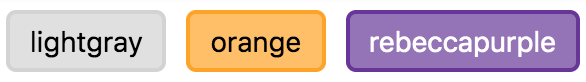

# reshadow ⛱️

Write semantic styles and components, as the soul wants.

[](https://travis-ci.org/lttb/reshadow)
[](https://img.shields.io/coveralls/lttb/reshadow/master.svg?branch=master)
[](https://www.npmjs.com/package/reshadow)
[](https://github.com/kentcdodds/babel-plugin-macros)

> This project has `alpha` status, so the API and the implementation could be changed.

```sh
npm i --save reshadow@alpha
```

**reshadow** provides the Shadow DOM developer experience, but for the Virtual DOM with the Component way.

## Features

-   Get away from additional abstractions
    -   Write isolated semantic styles for the Virtual DOM in a native like way
    -   Match styles on the elements, components, and props. That's all you need
-   Compile-time styles processing and efficient runtime
-   Static styles extracting options
-   Static analysis
-   Combine the `css-in-js` and `css-modules` approaches or choose which fits you better
-   All the benefits of the PostCSS ecosystem
-   Interoperable. Use it with components in [React](https://github.com/facebook/react), [Preact](https://github.com/developit/preact/), [Vue](https://github.com/vuejs/vue), [htm](https://github.com/developit/htm/).

Please check the [reshadow.dev](https://reshadow.dev) for more information and examples.

There are some examples on the [Сodesandbox](https://codesandbox.io):

-   [React (create react app)](https://codesandbox.io/s/o9w535k0z6)
-   [Preact](https://codesandbox.io/s/o5jrpk0zm5)
-   [Vue](https://codesandbox.io/s/rw1r211m8p)
-   [htm](https://codesandbox.io/s/kkxvrwz217)

## Docs

-   [Usage](#usage)
-   Setup
    -   [macro](#macro)
    -   [babel](#babel)
    -   [postcss](#postcss)
    -   [webpack](#webpack)
-   [Linting](#linting)

## Example

```js
import React from 'react';
import styled from 'reshadow';
```

```js
import {readableColor, rgba} from 'polished';

const Button = ({
    bgcolor = 'lightgray',
    size = 's',
    children,
    ...props
}) => styled`
    button {
        cursor: pointer;
        padding: 5px 10px;
        border-radius: 5px;
        border: 2px solid ${bgcolor};
        background-color: ${rgba(bgcolor, 0.7)};
        color: ${readableColor(bgcolor)};
        transition: background-color 0.5s;

        &:hover {
            background-color: ${rgba(bgcolor, 0.9)};
        }
    }

    /**
     * Match on the 'disabled' prop,
     * not the DOM attribute
     **/
    button[disabled] {
        opacity: 0.5;
        pointer-events: none;
    }

    /**
     * Match on the 'use:size' prop
     */
    button[use|size='s'] {
        font-size: 12px;
    }

    /* The 'use' namespace can be omitted */
    button[|size='m'] {
        font-size: 14px;
    }
`(
    /* use:size property would not pass to the DOM */
    <button {...props} use:size={size}>
        {children}
    </button>,
);
```

```js
const Container = () => styled`
    Button + Button {
        margin-left: 10px;
    }
`(
    <div>
        <Button size="m" bgcolor="lightgray">
            lightgray
        </Button>
        <Button size="m" bgcolor="orange">
            orange
        </Button>
        <Button size="m" bgcolor="rebeccapurple">
            rebeccapurple
        </Button>
    </div>,
);
```



## Usage

### css-modules

_Button/index.js_

```js
import React from 'react';
import styled from 'reshadow';

import styles from './styles.css';

export const Button = ({size, children}) =>
    styled(styles)(<button use:size={size}>{children}</button>);
```

_Button/styles.css_

```css
button {
    /* button styles */
}
button[|size='m'] {
    /* button styles for the size */
}
```

### css-in-js

```js
import React from 'react';
import styled, {css} from 'reshadow';

const anotherStyles = css`
    button[disabled] {
        /* disabled button styles */
    }
`;

export const Button = ({size, children}) => styled(
    props.another && anotherStyles,
)`
    button {
        /* button styles */
    }
    button[|size='m'] {
        /* button styles for the size */
    }
`(<button use:size={size}>{children}</button>);
```

## Setup

### Macro

With [CRA 2](https://github.com/facebook/create-react-app) (Create React App) or [babel-plugin-macros](https://github.com/kentcdodds/babel-plugin-macros) usage you can just use `reshadow/macro` out of the box.

```js
import React from 'react';
import styled from 'reshadow/macro';

export const Button = ({children}) => styled`
    button {
        /* button styles */
    }
`(<button>{children}</button>);
```

Options (via [babel-plugin-macros config](https://github.com/kentcdodds/babel-plugin-macros/blob/master/other/docs/author.md#config-experimental)) are the same as `reshadow` [babel options](#babel-options), but with different defaults:

| option  | default value     |
| ------- | ----------------- |
| postcss | true              |
| files   | /\.shadow\.css\$/ |

### Babel

Add `reshadow/babel` to the plugin list.

`babel.config.js`

```js
module.exports = {
    plugins: ['reshadow/babel'],
};
```

#### Options

| option          | type                           | default value | description                                                                                    |
| --------------- | ------------------------------ | ------------- | ---------------------------------------------------------------------------------------------- |
| postcss         | boolean \| {plugins: Plugin[]} | false         | Use PostCSS to process CSS code. You can add your custom PostCSS plugins (they should be sync) |
| files           | boolean \| RegExp              | false         | Resolve and process `css` files imports that match to the RegExp                               |
| elementFallback | boolean \| string              | 'div'         | Use fallback for the custom elements                                                           |

### PostCSS

Add `reshadow/postcss` to the plugin list.

`postcss.config.js`

```js
module.exports = {
    plugins: ['reshadow/postcss'],
};
```

### Webpack

Use `reshadow/webpack/loader` to extract styles in separate files.

_webpack.config.js_

```js
{
    test: /\.js$/,
    use: [
        'reshadow/webpack/loader',
        'babel-loader',
    ]
}
```

### Linting

Use `reshadow/eslint` if you want to have more control about `reshadow` usage.

Rules:

-   [as-attribute](src/eslint/rules/as-attribute/index.js)

### Prettier

Use `reshadow/prettier` if you want to improve your Developer Experience with [prettier](https://github.com/prettier/prettier).

_prettier.config.js_

```js
module.exports = {
    plugins: ['reshadow/prettier'],
};
```

# Special Thanks

-   Pavel Masalsky [@pavelrevers](https://github.com/pavelrevers)
-   Anton Kastritskiy [@antonk52](https://github.com/antonk52)
